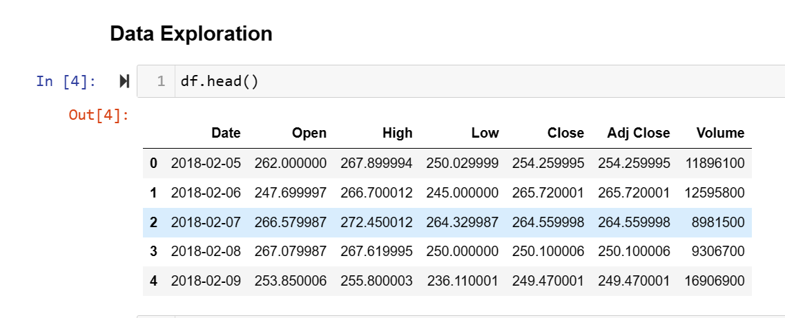
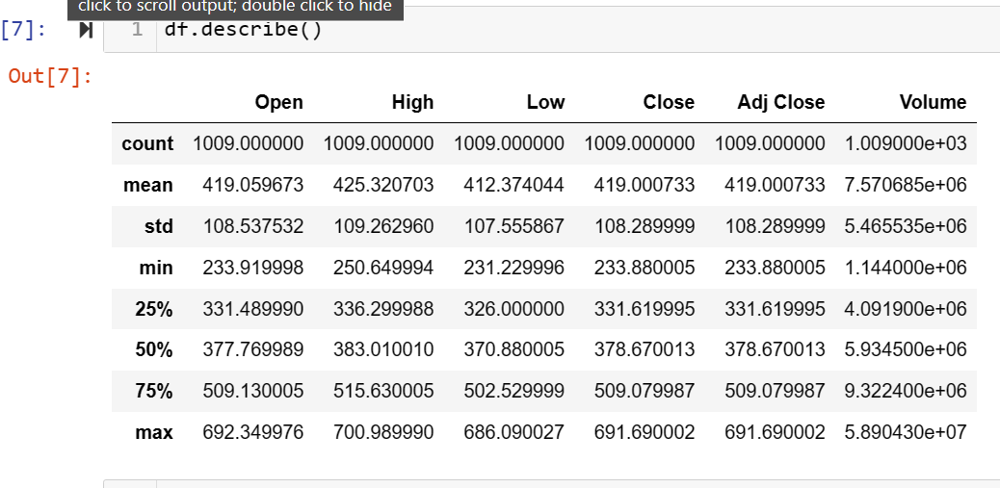
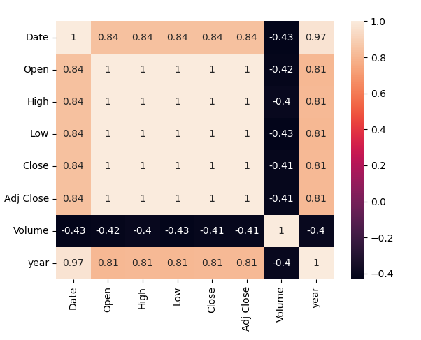
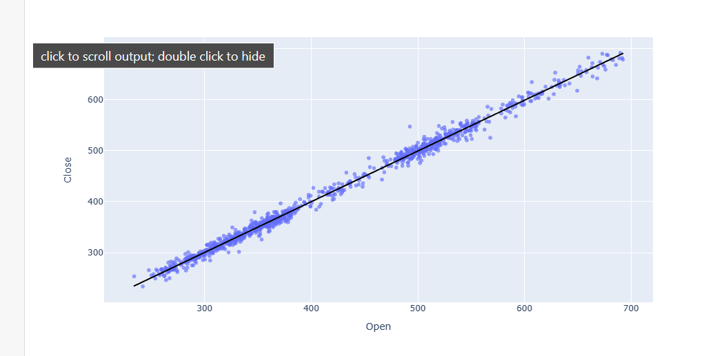
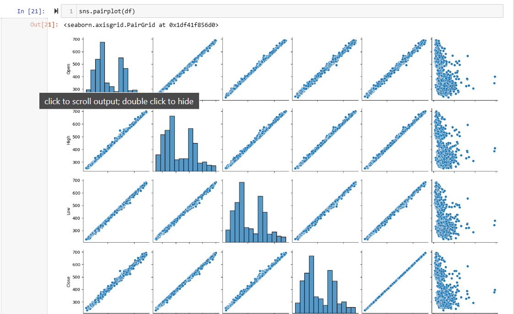
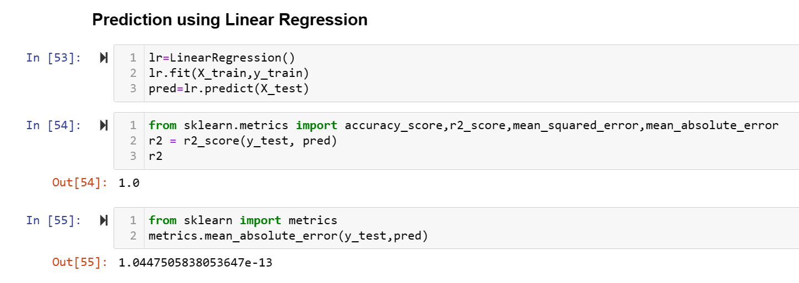
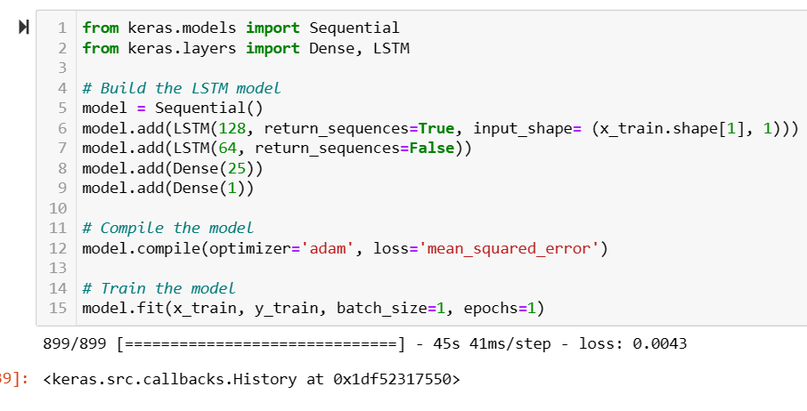

# Netflix-Stock-Price-Prediction
## Akshay Sreeramoju

- Jupyter notebook: **Stocks.ipynb**

# Table of contents
1. [Introduction](#introduction)

2. [Description of the data set](#section2)
    1. [Initial steps](#sec2p1)
    2. [Descriptive statistics](#sec2p2)
    3. [Corelation](#sec2p4)

3. [Regression](#section3)
    1. [Regression in Seaborn and Plotly](#sec3p1)
    4. [Regression with scikit-learn](#sec3p4)
    5. [Linear regression on various subsets of the data](#sec3p5)
    
4. [Relationships between variables](#section4)
    1. [Visualize relationships between numerical variables with pairplot](#sec4p1)
    3. [Regression Algorithm](#sec4p3)
    4. [LSTM](#sec4p4)
    
5. [Work done by other people on the Tips data set](#section5)
    
6. [Conclusion](#conclusion)

9. [References](#references)

## 1. Introduction 
- This README describes work done on the  data set for the Fundamentals of Data Analysis include Python and associated packages Jupyter, matplotlib, Seaborn, scikit-learn, statsmodels, and SciPy.
- The analysis takes the form of a single Jupyter notebook of filename given above. To view this file, download it from this repository and start Jupyter notebook in the folder containing the file. Use the command **Jupyter notebook** on the command line. 
- All images intended for inclusion in this README are located in the **images** subdirectory of this repository.
- I have tried to structure the Jupyter notebook and this README so that they have corresponding sections. However, I do not wish to merely repeat here what has been stated in the notebook. I will endeavour to have this README summarize the work of the notebook and, hopefully, complement the analyses done there.

##  2. Description of the data set 
 Dataset contains data related to Netflix, a popular streaming service.Provide a list of the columns or fields present in the CSV file. For example:
Date: The date of the data entry.
Open: The opening stock price of Netflix on that particular date.
High: The highest stock price of Netflix on that particular date.
Low: The lowest stock price of Netflix on that particular date.
Close: The closing stock price of Netflix on that particular date.
Volume: The trading volume of Netflix on that particular date.
Adjusted Close: The adjusted closing stock price of Netflix on that particular date. 

### 2.1 Initial steps 
The very first step is always to check if the data needs cleaning by looking for duplicate rows, zero values or NaNs where they shouldn't be, etc. Our data set is small enough to inspect visually and it looks fine. Counting the number of valid entries in each column confirms this. The head of the data set looks like:

### 2.2 Descriptive statistics 
Pandas **describe()** can provide a quick summary of the data set as outlined in the notebook. However, without looking at the data in more detail, we cannot yet state what we think a typical Stock price is. **describe()** provides the mean,meadian,variance ,count etc... The output of pandas **describe(include="all")** is shown below. Here, all columns of the DataFrame are included in the analysis.

### 2.4 Co-relation 
Correlation is a way to determine if two features in a dataset are related in any way.Correlation is one of the most important statistical terms used in data science. It is used to measure the intensity of relationships between variables.**corr()** When the value is close to 1, it means that there is a strong positive correlation, and when the value is close to -1, it means that there is a strong negative correlation. And when the values are close to 0, it means that there is no correlation

##  3. Regression 
For this part of the assessment, we have been asked to analyse if there is a relationship between the total bill and the tip amount. The simplest relationship would be a linear one. That's reasonable when we consider that tips (especially in the US) are usually a fixed percentage of the total bill. A linear model looks like:

**y = m x + c**

where
- y is the tip
- x is the total bill
- m is the slope of the line
- c is the y intercept

### 3.1 Regression in Seaborn and Plotly
In the notebook we first use Seaborn and plotly to visualize any linear relationship between our two variables of interest using **regplot** . This does not give us any fitting parameters such as the slope and intercept of the linear fit, or any metrics to assess the quality of the fit, but it's a good start. Here we plot the best straight lines through Open and Close, as found by Seaborn.

### 3.4 Regression with scikit-learn 
Scikit-learn is a machine learning package which can also perform OLS fitting. Strictly speaking there is no need to perform regression with both packages, but I do it once in the notebook and then stick to scikit-learn.  This package is useful for making predictions using the data set, something we may get on to later. We use the scikit-learn LinearRegression model which performs OLS fitting.

In regression, R2 is the coefficient of determination, a measure of how close the data points are to the fitted regression line; or how much of the variation in the data is explained by the linear model. It ranges from 0 to 1, and in general, higher values of R2 are better., values of R2 less that 0.5 are not unusual; we find R2 = 0.457 on average. It's also important to take into account the appropriateness of the model when assessing R2.. 

To conclude this part of the analysis: the Close does depend linearly on the Open in this data set. The slope of the best fit line is 0.994, the y intercept is 2.24, and R2 is 0.993.

**Tip predictions:**

We can use our linear regression parameters and LSTM(Long Short Term Memory) to predict.
  

### 4.1 Visualize relationships between numerical variables with pairplot 
The Seaborn **pairplot** function plots pairwise relationships in a data set. It generates a grid of scatterplots of each numeric variable plotted against all the others, and a histogram of values when a variable is plotted against itself. The *hue* keyword can be used to differentiate between the different categorical variables on each subplotA variable could be used to separate categories if the histograms for different categories do not overlap too much. We don't see much evidence for that in the pairplot - unlike say in the iris data set - so I'll take it no further. Below is a Seaborn pairplot for this data set.

### 4.4 Regression Algorithm 
Linear Regression Algorithm is a statistical technique for calculating the value of a dependent variable based on the value of an independent variable. The goal of linear regression is to find the best-fit line that describes the relationship between the dependent and the independent variable.It finds the best-fit line that describes the relationship between the input variable and the output variable so we can predict the output variable based on a new input variable.
#### Implementation of Linear Regression Algorithm

### Long Short Term Memory(LSTM)  
LSTM model was generally designed to prevent the problems of long term dependencies which they generally do in a very good manner.The LSTM Network models generally have potential to remove or add data carefully which is regulated by a special structure known as gates. 

#### Stock Price Prediction using LSTM

## 6. Conclusion 
we undertook a comprehensive analysis of Netflix stock price prediction. Our primary objectives were to develop and assess machine learning models for predicting Netflix's stock prices and to gain insights into the factors driving its price movements.our Netflix stock price prediction project provides valuable insights into the stock's price movements and offers a foundation for developing more accurate and effective prediction models. 

## 7. References 

**General:**

- [1] Python Software Foundation
https://www.python.org/

- [2] Project Jupyter
https://jupyter.org/

- [3] seaborn: statistical data visualization
https://seaborn.pydata.org/index.html#

- [4] matplotlib: Python plotting library
https://matplotlib.org/

- [5] scikit-learn: Machine Learning in Python
https://scikit-learn.org/stable/index.html
